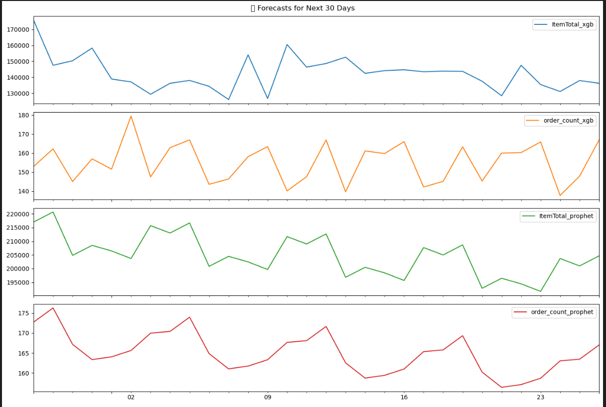

# 🍽️ Kuruduwatta Restaurant - Time Series Forecasting

This repository forecasts **daily and weekly demand** for **Kuruduwatta Restaurant** using a unified Python script that includes:

- Data preprocessing
- Forecasting with **Prophet**
- Forecasting with **XGBoost**
- Visualization of historical and future data

The aim is to support better planning, resource allocation, and inventory management.

---

## 📌 Project Scope

- ✅ Forecast for next **60 days** (day-wise and week-wise)
- 📅 Extended projections:
  - **6 months** (assumed trend continuation)
  - **1 year** (long-term signal assumption)
- 🧠 Models Used:
  - [Prophet](https://facebook.github.io/prophet/) – Seasonality-focused model
  - [XGBoost](https://xgboost.readthedocs.io/) – Gradient boosting for time series

---

## 📊 Visual Outputs

### 1. Historical Trend Visualization

Shows sales/footfall patterns used for training.


*Figure 1: Raw historical trends (past 6 months)*


*Figure 2: Cleaned and preprocessed time series*

### 2. Forecast Visualization (Next 60 Days)

Forecasts using Prophet and XGBoost models.


*Figure 3: Day-wise and week-wise forecast for next 60 days*

---

## ⚙️ How It Works

The entire workflow is in a **single script**: `forecast_kuruduwatta.py`

### 🔹 Key Steps:

1. **Load & Clean Data**
   - Handle missing values, resample, aggregate

2. **Feature Engineering**
   - Date features, lag values, rolling stats

3. **Modeling**
   - Train Prophet model
   - Train XGBoost using lag features

4. **Forecasting**
   - Generate daily & weekly forecasts
   - Extend forecasts to 6 months and 1 year (assumed continuation)

5. **Visualization**
   - Plot historical and forecasted trends
last output as below 

           ds       forecast    lower_bound    upper_bound
0  2025-05-28  216995.690700  162223.855377  270514.682455
1  2025-05-29  220667.720375  163108.096294  277997.416890
2  2025-05-30  204837.472566  146602.722916  260261.559345
3  2025-05-31  208482.518705  155260.406734  262902.414095
4  2025-06-01  206453.595920  151402.200629  261418.441350

## ▶️ Getting Started

### 1. Install Dependencies

```bash
pip install -r requirements.txt
