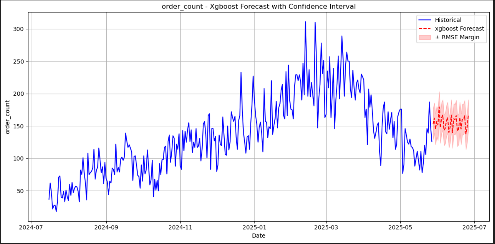
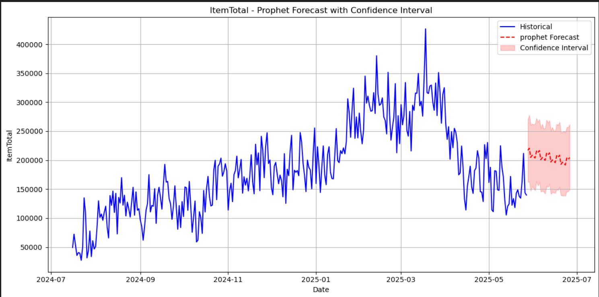

# 🍽️ Kuruduwatta Restaurant - Time Series Forecasting

This repository forecasts **daily and weekly demand** for **Kuruduwatta Restaurant** using a unified Python script that includes:

- Data preprocessing
- Forecasting with **Prophet**
- Forecasting with **XGBoost**
- Visualization of historical and future data

The aim is to support better planning, resource allocation, and inventory management.

---

## 📌 Project Scope

- ✅ Forecast for next **60 days** (day-wise and week-wise)
- 📅 Extended projections:
  - **6 months** (assumed trend continuation)
  - **1 year** (long-term signal assumption)
- 🧠 Models Used:
  - [Prophet](https://facebook.github.io/prophet/) – Seasonality-focused model
  - [XGBoost](https://xgboost.readthedocs.io/) – Gradient boosting for time series

---

## 📊 Visual Outputs

### 1. Historical Trend Visualization

Shows sales/footfall patterns used for training.

*Figure 1: Raw historical trends (past 6 months)*

*Figure 2: Cleaned and preprocessed time series*

### 2. Forecast Visualization (Next 60 Days)

Forecasts using Prophet and XGBoost models.

*Figure 3: Day-wise and week-wise forecast for next 60 days*

---

## ⚙️ How It Works

The entire workflow is in a **single script**: `forecast_kuruduwatta.py`

### 🔹 Key Steps:

1. **Load & Clean Data**
   - Handle missing values, resample, aggregate

2. **Feature Engineering**
   - Date features, lag values, rolling stats

3. **Modeling**
   - Train Prophet model
   - Train XGBoost using lag features

4. **Forecasting**
   - Generate daily & weekly forecasts
   - Extend forecasts to 6 months and 1 year (assumed continuation)

5. **Visualization**
   - Plot historical and forecasted trends
last output as below 

#### 📋 Sample Forecast Output (Daily)

| Date       | Forecast Value | Lower Bound    | Upper Bound    |
|------------|----------------|----------------|----------------|
| 2025-05-28 | 216,995.69     | 162,223.86     | 270,514.68     |
| 2025-05-29 | 220,667.72     | 163,108.10     | 277,997.42     |
| 2025-05-30 | 204,837.47     | 146,602.72     | 260,261.56     |
| 2025-05-31 | 208,482.52     | 155,260.41     | 262,902.41     |
| 2025-06-01 | 206,453.60     | 151,402.20     | 261,418.44     |

